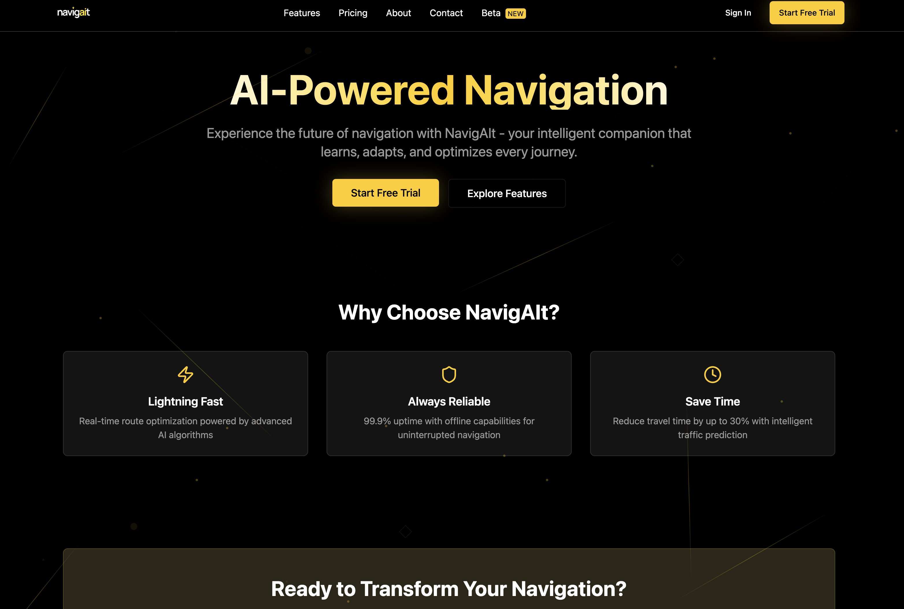

# NavigAIt – AI-Powered Navigation Platform

NavigAIt is an intelligent navigation platform designed to make every journey smarter, safer, and more efficient. By combining cutting-edge AI with real-time data and user behavior insights, NavigAIt adapts routes to individual preferences and traffic conditions, helping users save time, reduce stress, and travel more sustainably.

---

## 🚀 Key Features

- **AI-Powered Routing:** Personalized, adaptive routes that learn from user behavior.  
- **Real-Time Optimization:** Predictive traffic and hazard analysis for faster, safer travel.  
- **User-Centric Design:** Intuitive interface designed for simplicity and accessibility.  
- **Mission & Values:** Focused on innovation, safety, continuous learning, and user empowerment.  
- **Analytics & Metrics:** Insights on active users, miles navigated, uptime, and efficiency improvements.  
- **Team & Expertise:** Led by experts in AI navigation, product design, and predictive analytics.  

---

## 🛠 Tech Stack

- **Framework:** React + Next.js  
- **Styling:** Tailwind CSS  
- **UI Components:** Reusable Cards, Badges, Navbar, Footer  
- **Icons:** Lucide-react  
- **Data Visualization:** Charts and metrics for user insights  

---

## 🎯 Vision

NavigAIt aims to democratize intelligent navigation technology, making AI-powered route optimization accessible to everyone. By prioritizing safety, efficiency, and sustainability, NavigAIt transforms everyday travel into a smarter, more reliable experience.

